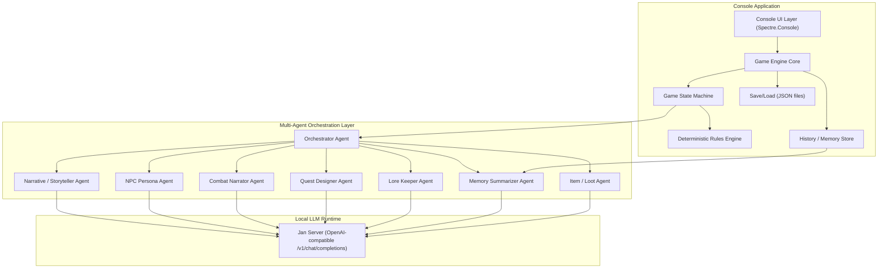
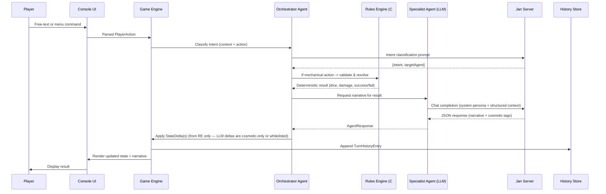
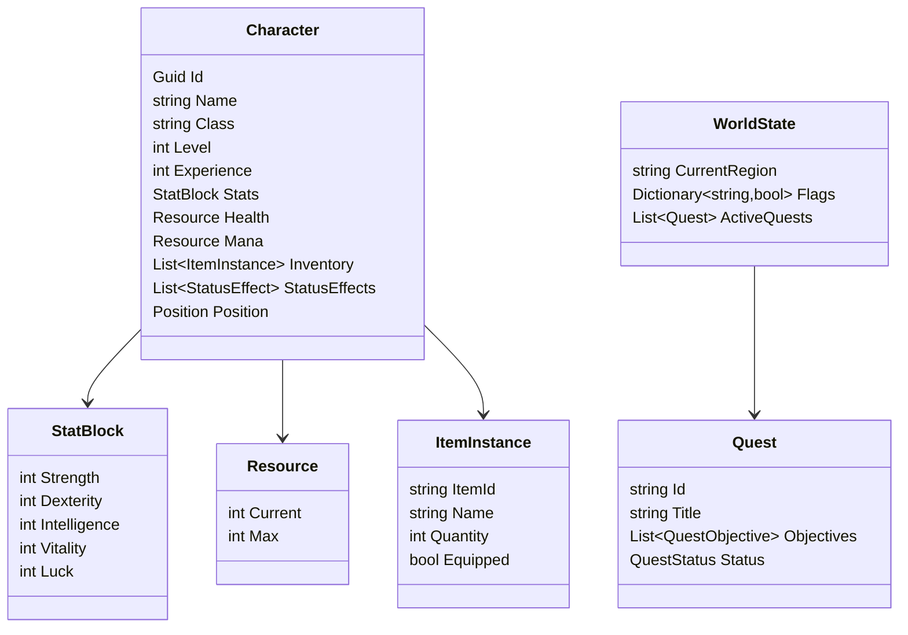

Below is a complete design document formatted as Markdown. You can copy the content between the outer fences into a file named `RPG_GAME_DESIGN.md`.

````markdown
# Local-LLM Powered Console RPG — Design & Implementation Plan

**Stack:** C# / .NET 8, Console App, Spectre.Console for UI, Jan Server (local LLM, OpenAI-compatible API) for narrative/agent intelligence.

---

## 1. Concept Overview

A single-player, turn-based text RPG running in the console. Game **mechanics** (stats, dice rolls, HP, inventory) are handled **deterministically in C#** for reliability and balance. A **multi-agent LLM layer** (served locally via Jan) generates narrative flavor, NPC dialogue, quest text, and world lore, guided by structured context supplied by the engine.

> **Key design principle:** LLMs never compute game math directly. They receive deterministic results (e.g., "12 damage dealt, critical=false") and are asked to *narrate* them, or they propose intents that a **Rules Engine** validates before anything is applied to game state.

---

## 2. High-Level Architecture



> **Note on "multi-agent":** Jan typically serves one (or a small number of) local models at a time. "Agents" here are a **software/prompting abstraction** — each agent has its own system prompt, persona, temperature, and response schema — not necessarily separate models. The architecture is designed so a specific agent *could* later be pointed at a different model/endpoint without refactoring.

---

## 3. Technology Stack

| Concern | Choice | Notes |
|---|---|---|
| Runtime | .NET 8 | LTS, fast startup for console apps |
| Console UI | **Spectre.Console** | Rich text, tables, panels, live layouts, prompts, progress bars, markup |
| Alternative UI | Terminal.Gui | If a windowed/multi-pane TUI is wanted later |
| DI / Hosting | Microsoft.Extensions.Hosting | `IHost`, DI container, config, logging even in console apps |
| Config | Microsoft.Extensions.Configuration (appsettings.json + env vars) | Jan server URL, model name, agent temperature |
| HTTP resiliency | Polly | Retry/backoff for calls to Jan server |
| Serialization | System.Text.Json | Structured agent I/O |
| Persistence | JSON files (per save slot) via `System.Text.Json` | Simple; can swap to LiteDB/SQLite later |
| Logging | Serilog or Microsoft.Extensions.Logging + Console/File sink | Debugging LLM prompts/responses |
| Testing | xUnit + FluentAssertions + Moq | Unit tests for Rules Engine and Agent parsing |

---

## 4. Multi-Agent System

### 4.1 Agent Roster

| # | Agent | Role | Trigger | Input | Output |
|---|---|---|---|---|---|
| 1 | **Orchestrator Agent** | Central "Game Master" — classifies player intent, decides which specialist agent(s) to invoke, keeps narrative coherent | Every player free-text input | Player input, condensed session state | Routing decision (+ optional direct narrative for simple cases) |
| 2 | **Narrative / Storyteller Agent** | Generates scene/environment descriptions, exploration flavor text, transition text | Entering new location, ambient events, exploration actions | Location data, world state, recent history | Descriptive prose |
| 3 | **NPC Persona Agent** | Roleplays a specific NPC using a persona template (personality, goals, speech style, relationship to player) | Dialogue state active | NPC profile, conversation history, player line | In-character dialogue line(s), optional relationship/state changes |
| 4 | **Combat Narrator Agent** | Turns deterministic combat results into dramatic narration; may suggest minor flavor effects (non-mechanical) | After Rules Engine resolves a combat action | Deterministic combat result, combatant states | Narrative text, cosmetic event tags |
| 5 | **Quest Designer Agent** | Generates new quest hooks/objectives and updates quest text based on world state and player progress | Quest board visited / milestone reached | World state, player level, completed quests | Structured quest object (title, objectives, rewards hint) |
| 6 | **Lore Keeper Agent** | Enforces world/lore consistency; answers "ask about the world" queries; validates that other agents' outputs don't contradict established lore | On demand (player asks lore question) or as a validation pass | Lore database excerpt, proposed narrative | Lore-consistent answer or correction flags |
| 7 | **Memory Summarizer Agent** | Periodically compresses long turn history into concise rolling summaries to keep LLM context small | Every N turns or on context-size threshold | Raw history log slice | Updated `sessionSummary` string |
| 8 | **Item / Loot Agent** | Generates flavorful item names/descriptions for procedurally rolled loot (stats rolled deterministically, description generated) | Loot drop event | Item rarity/type/stat roll (from Rules Engine) | Item name + flavor description |

### 4.2 Orchestration Flow (per turn)



**Important safeguard:** Only the **Rules Engine** (deterministic C#) is authorized to mutate numeric stats (HP, gold, inventory quantities). Specialist agents may only:
- Return narrative text.
- Return *cosmetic* events (status flair, mood tags).
- Return *requests* that must pass through the Rules Engine before being applied (e.g., "NPC offers a trade" → must be validated by inventory rules before executing).

This prevents hallucinated stat changes from corrupting game state.

---

## 5. C# Solution Architecture

### 5.1 Project Structure

```
RpgGame.sln
 ├─ src/
 │   ├─ RpgGame.Core/            # Domain models, interfaces, enums
 │   ├─ RpgGame.Engine/          # Game loop, state machine, rules engine
 │   ├─ RpgGame.Agents/          # Agent orchestration, prompt builders, Jan client
 │   ├─ RpgGame.Persistence/     # Save/load, history repository
 │   ├─ RpgGame.UI/              # Spectre.Console screens/widgets
 │   └─ RpgGame.App/             # Program.cs, DI composition root, appsettings.json
 └─ tests/
     ├─ RpgGame.Core.Tests
     ├─ RpgGame.Engine.Tests
     └─ RpgGame.Agents.Tests
```

### 5.2 Core Domain Models (RpgGame.Core)



### 5.3 Game State Machine (RpgGame.Engine)

A **stack-based state machine** allows overlay states (e.g., open Inventory while paused in Exploration).

```csharp
public interface IGameState
{
    void OnEnter(GameContext ctx);
    void OnExit(GameContext ctx);
    Task HandleInputAsync(string input, GameContext ctx);
    void Render(GameContext ctx);
}

public class GameStateMachine
{
    private readonly Stack<IGameState> _states = new();
    public void Push(IGameState state, GameContext ctx) { ... }
    public void Pop(GameContext ctx) { ... }
    public IGameState Current => _states.Peek();
}
```

States: `MainMenuState`, `CharacterCreationState`, `ExplorationState`, `DialogueState`, `CombatState`, `InventoryState`, `QuestLogState`, `SaveLoadState`, `GameOverState`.

### 5.4 Rules Engine

Deterministic, testable, no LLM dependency:

```csharp
public interface IRulesEngine
{
    CombatResolution ResolveAttack(Character attacker, Character defender, Ability ability);
    LootResult RollLoot(EncounterDifficulty difficulty);
    bool ValidateAction(PlayerAction action, GameContext ctx, out string reason);
}
```

Uses standard RPG formulas (to-hit %, damage = base + STR modifier ± variance, critical chance from LUK/DEX). Fully unit-testable without any LLM in the loop.

### 5.5 Design Patterns Used

| Pattern | Where | Why |
|---|---|---|
| **State** | Game flow (Exploration/Combat/Dialogue) | Clean separation of per-mode input/render logic |
| **Command** | Player input → `IPlayerAction` objects | Decouples parsing from execution, enables undo/logging |
| **Mediator / Event Bus** | `IGameEventBus` connecting Engine ↔ UI ↔ Agents | Loose coupling, easy to add new listeners (e.g., achievement tracker) |
| **Strategy** | Combat resolution formulas, difficulty scaling | Swap rule sets without touching engine core |
| **Repository** | `IHistoryRepository`, `ISaveGameRepository` | Abstracts persistence backend |
| **Factory** | `CharacterFactory`, `EnemyFactory`, `ItemFactory` | Consistent object creation from data templates (JSON) |
| **Adapter** | `IJanClient` wrapping HTTP calls to Jan server | Isolates LLM transport details; swappable backend |
| **Template Method** | `AgentBase.ExecuteAsync()` | Shared prompt-build → call → parse pipeline per agent, overridable steps |
| **Options Pattern** | `JanOptions`, `AgentOptions` bound from `appsettings.json` | Centralized, typed configuration |

### 5.6 Agent Layer (RpgGame.Agents)

```csharp
public interface ILlmClient
{
    Task<LlmChatResponse> CompleteAsync(LlmChatRequest request, CancellationToken ct = default);
}

public class JanLlmClient : ILlmClient
{
    // POSTs to {JanBaseUrl}/v1/chat/completions
    // Supports response_format = json_object for structured output
}

public abstract class AgentBase<TRequest, TResponse>
{
    protected abstract string SystemPrompt { get; }
    protected abstract TRequest BuildContext(GameContext ctx, PlayerAction action);
    protected abstract TResponse ParseResponse(string rawJson);

    public async Task<TResponse> ExecuteAsync(GameContext ctx, PlayerAction action, ILlmClient client)
    {
        var payload = BuildContext(ctx, action);
        var request = new LlmChatRequest {
            Messages = new [] {
                new ChatMessage("system", SystemPrompt),
                new ChatMessage("user", JsonSerializer.Serialize(payload))
            },
            ResponseFormatJson = true
        };
        var raw = await client.CompleteAsync(request);
        return ParseResponse(raw.Content);
    }
}

public class CombatNarratorAgent : AgentBase<CombatAgentRequest, CombatAgentResponse> { ... }
public class NpcPersonaAgent : AgentBase<NpcAgentRequest, NpcAgentResponse> { ... }
// etc.

public class OrchestratorAgent
{
    // Classifies intent, routes to correct specialist agent, merges results
}
```

---

## 6. Console UI

**Recommended library: [Spectre.Console](https://spectreconsole.net/)**

Reasons:
- Rich markup (`[bold red]...[/]`) for narrative styling without manual ANSI codes.
- Built-in `Table`, `Panel`, `Rule`, `Tree` for character sheets, inventory grids, quest logs.
- `Prompt<T>` / `SelectionPrompt` for menu navigation (combat action selection, dialogue choices).
- `Live` display for animated status bars (HP/MP) without flicker.
- `Progress` for loading/streaming LLM responses ("The Narrator is thinking...").
- Testable via `TestConsole`.

Example screen composition:

```csharp
AnsiConsole.Write(new Panel(narrativeText)
    .Header("[yellow]The Whispering Woods[/]")
    .Border(BoxBorder.Rounded));

var table = new Table().AddColumn("Stat").AddColumn("Value");
table.AddRow("HP", $"{player.Health.Current}/{player.Health.Max}");
AnsiConsole.Write(table);

var choice = AnsiConsole.Prompt(
    new SelectionPrompt<string>()
        .Title("What will you do?")
        .AddChoices("Attack", "Defend", "Use Item", "Flee"));
```

*Alternative:* **Terminal.Gui** if a full multi-pane windowed TUI (persistent side panel for stats + main narrative pane + input box) is desired later. Recommend starting with Spectre.Console for simplicity, since it fits a "fairly simple RPG."

---

## 7. Communication Data Model

All agent I/O is JSON, validated against POCOs via `System.Text.Json`. Below are representative schemas.

### 7.1 Character Sheet

```json
{
  "id": "player-001",
  "name": "Aria Stormblade",
  "class": "Ranger",
  "level": 5,
  "experience": 1240,
  "stats": { "strength": 12, "dexterity": 18, "intelligence": 10, "vitality": 14, "luck": 9 },
  "health": { "current": 42, "max": 55 },
  "mana": { "current": 15, "max": 20 },
  "inventory": [
    { "itemId": "itm-203", "name": "Steel Longbow", "quantity": 1, "equipped": true },
    { "itemId": "itm-045", "name": "Healing Potion", "quantity": 3, "equipped": false }
  ],
  "statusEffects": [],
  "position": { "region": "Whispering Woods", "location": "Old Bridge" }
}
```

### 7.2 Orchestrator Routing Decision

```json
{
  "requestId": "a71c9e2a-...-uuid",
  "playerInput": "I shoot the goblin with my bow",
  "classifiedIntent": "CombatAction",
  "targetAgent": "CombatNarratorAgent",
  "requiresRulesEngine": true,
  "confidence": 0.94
}
```

### 7.3 Generic Agent Request Envelope

```json
{
  "requestId": "b3f10c44-...-uuid",
  "agentType": "CombatNarratorAgent",
  "timestamp": "2025-05-01T12:00:00Z",
  "systemContext": {
    "worldTone": "dark fantasy, low humor",
    "sessionSummary": "Aria has been tracking a goblin raiding party through the Whispering Woods."
  },
  "gameState": {
    "player": { "...": "CharacterSheet as above" },
    "enemies": [
      { "id": "enemy-goblin-1", "name": "Goblin Skirmisher", "health": { "current": 20, "max": 20 } }
    ]
  },
  "action": {
    "type": "Attack",
    "actor": "player-001",
    "target": "enemy-goblin-1",
    "meta": { "weapon": "Steel Longbow", "roll": 17, "damage": 12, "critical": false }
  },
  "recentHistory": [
    { "turn": 41, "summary": "Aria fired an arrow, missing the goblin scout." }
  ]
}
```

### 7.4 Generic Agent Response Envelope

```json
{
  "requestId": "b3f10c44-...-uuid",
  "agent": "CombatNarratorAgent",
  "narrative": "Aria's arrow whistles through the fog and buries itself in the goblin's shoulder. It shrieks, stumbling back against the rocks.",
  "stateChanges": [
    { "target": "enemy-goblin-1", "path": "health.current", "op": "add", "value": -12 }
  ],
  "events": ["GoblinWounded"],
  "suggestions": { "nextAgent": null, "endCombat": false }
}
```

> `stateChanges` emitted by an LLM agent are **advisory**; the Rules Engine cross-checks that they match the deterministic result already computed (`meta.damage` in the request) before committing to `WorldState`. Mismatches are logged and discarded (defensive parsing).

### 7.5 State Delta (applied only by Rules/Engine layer)

```json
{ "target": "enemy-goblin-1", "path": "health.current", "op": "add", "value": -12 }
```
`op`: `add | set | append | remove`

### 7.6 Turn History Entry

```json
{
  "turnNumber": 42,
  "timestamp": "2025-05-01T12:00:05Z",
  "actor": "player-001",
  "actionType": "Attack",
  "narrative": "Aria's arrow whistles through the fog and buries itself in the goblin's shoulder...",
  "stateChanges": [
    { "target": "enemy-goblin-1", "path": "health.current", "op": "add", "value": -12 }
  ],
  "location": "Whispering Woods / Old Bridge"
}
```

### 7.7 Raw Jan Server Request (OpenAI-compatible)

```json
{
  "model": "llama-3-8b-instruct",
  "messages": [
    {
      "role": "system",
      "content": "You are the Combat Narrator Agent for a dark fantasy RPG. Respond ONLY with valid JSON matching the AgentResponse schema. Never invent numeric outcomes; use the provided deterministic result."
    },
    {
      "role": "user",
      "content": "{ ...serialized AgentRequest JSON from 7.3... }"
    }
  ],
  "temperature": 0.8,
  "max_tokens": 400,
  "response_format": { "type": "json_object" }
}
```

### 7.8 Memory Summarizer Output

```json
{
  "sessionSummary": "Aria (Lvl 5 Ranger) is hunting a goblin raiding party in the Whispering Woods. She has wounded the scout and is low on stamina. Active quest: 'Silence the Raiders' (2/3 goblins defeated).",
  "coveredTurns": [1, 42]
}
```

---

## 8. Jan Server Integration

- Default endpoint: `http://localhost:1337/v1` (OpenAI-compatible).
- Config (`appsettings.json`):

```json
{
  "Jan": {
    "BaseUrl": "http://localhost:1337/v1",
    "Model": "llama-3-8b-instruct",
    "TimeoutSeconds": 30
  },
  "Agents": {
    "Orchestrator": { "Temperature": 0.3 },
    "Narrative": { "Temperature": 0.9 },
    "NpcPersona": { "Temperature": 0.85 },
    "CombatNarrator": { "Temperature": 0.7 },
    "QuestDesigner": { "Temperature": 0.8 },
    "LoreKeeper": { "Temperature": 0.4 },
    "MemorySummarizer": { "Temperature": 0.2 },
    "Loot": { "Temperature": 0.8 }
  }
}
```

- `JanLlmClient` uses `HttpClientFactory` + Polly retry policy (3 attempts, exponential backoff) since local inference can occasionally hang or return malformed JSON.
- Defensive parsing: if `response_format: json_object` still yields invalid JSON, fall back to a regex/JSON-repair pass; if that fails, retry once with a stricter system prompt ("Return ONLY JSON, no prose").

---

## 9. Persistence & History

- **Save files:** `saves/{slotName}/character.json`, `world.json`, `history.jsonl` (append-only line-delimited JSON for turn history — cheap to append, easy to tail for the Memory Summarizer).
- **History strategy:**
  - Full raw history kept on disk for debugging/replay.
  - In-memory "context window" only holds last N turns + `sessionSummary` (from Memory Summarizer) to keep LLM prompts small.
  - Memory Summarizer runs every ~15 turns or when estimated token count exceeds a threshold.

---

## 10. Implementation Plan (Phased Roadmap)

| Phase | Scope | Key Deliverables |
|---|---|---|
| **0. Setup** | Repo scaffolding, solution/projects, DI host, config, logging | Empty runnable console app, Jan connectivity smoke test |
| **1. Core Domain** | Character, StatBlock, Item, Quest, WorldState models | `RpgGame.Core` with unit tests |
| **2. Rules Engine** | Combat math, loot rolls, action validation | `IRulesEngine` + full test coverage, no LLM dependency |
| **3. State Machine & Game Loop** | Stack-based states, main loop, input parsing | Playable "silent" game (no narrative yet) with placeholder text |
| **4. Console UI** | Spectre.Console screens: main menu, HUD, combat menu, inventory, dialogue view | Polished navigable UI bound to engine state |
| **5. Jan Client & Agent Base** | `ILlmClient`, `JanLlmClient`, `AgentBase<TReq,TRes>`, JSON schemas | Successful round-trip call to Jan returning parsed JSON |
| **6. Orchestrator + Narrative Agent** | Intent classification, exploration narration | Player can explore and receive LLM-generated descriptions |
| **7. Combat Integration** | CombatNarratorAgent wired to Rules Engine output | Full combat loop: deterministic resolution + narrated flavor |
| **8. Dialogue & NPC Persona Agent** | NPC profile schema, dialogue state, conversation history | Talk to NPCs with persistent persona behavior |
| **9. Quest & Lore Agents** | QuestDesignerAgent, LoreKeeperAgent, quest log UI | Dynamic quest generation & tracking |
| **10. Loot Agent & Item System** | Deterministic loot rolls + flavor text generation | Procedural loot with LLM-generated descriptions |
| **11. Memory Summarizer** | Rolling summary generation, context trimming | Stable long-session play without context overflow |
| **12. Persistence** | Save/Load, slot management | Resume a session from disk |
| **13. Testing & Balancing** | Playtesting, prompt tuning, combat balance pass | Stable, fun core loop |
| **14. Polish** | Error handling for LLM downtime/timeouts, UI theming, help screen | Release-candidate build |

Suggested sequencing favors **deterministic engine first, LLM layered in afterward**, so the game is playable/testable even if the LLM integration is temporarily broken (graceful degradation: fallback to templated text if Jan is unreachable).

---

## 11. Testing Strategy

| Layer | Approach |
|---|---|
| Rules Engine | Pure unit tests (deterministic, no mocking needed) |
| Agents | Unit tests with mocked `ILlmClient` returning canned JSON; verify parsing & schema validation, including malformed-JSON fallback paths |
| State Machine | Unit tests simulating input sequences |
| Integration | Manual/scripted session against a real local Jan instance with a small model, plus a "golden transcript" regression test |
| UI | Spectre.Console `TestConsole` for output assertions on key screens |

---

## 12. Future Enhancements

- Swap single Jan model for per-agent model routing (e.g., a small fast model for Orchestrator intent classification, a larger model for Narrative/NPC agents).
- Add function-calling/tool-use support if Jan's backend model supports it, replacing manual JSON-envelope parsing.
- Vector-store-based long-term memory (RAG) for lore consistency across very long campaigns.
- Multiplayer/party system with multiple NPC Persona Agents active simultaneously.
- Terminal.Gui upgrade for a persistent multi-pane HUD.

````
